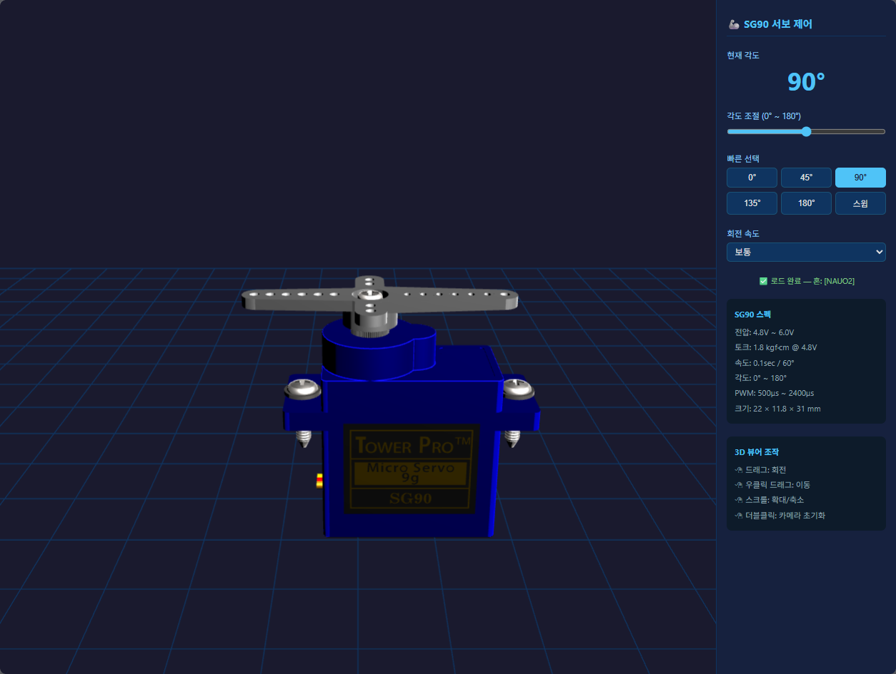

# 🦾 SG90 Micro Servo — SolidWorks → GLB → Node.js 3D 인터랙티브 제어

> SolidWorks로 설계된 SG90 서보모터 어셈블리를 GLB 포맷으로 변환하고,  
> Node.js 웹 서버 + Three.js로 브라우저에서 3D 인터랙티브 제어하는 완전 교육 가이드

* sg90 model : https://grabcad.com/library/sg90-micro-servo-9g-tower-pro-1
* cad-assistant : https://www.opencascade.com/products/cad-assistant/

---



## 📌 프로젝트 소개

| 항목 | 내용 |
|------|------|
| 대상 모델 | Tower Pro SG90 Micro Servo 9g |
| 원본 포맷 | SolidWorks 2018 어셈블리 (STEP AP214) |
| 변환 도구 | Blender 3.6 LTS |
| 3D 렌더링 | Three.js r159 (GLB / glTF 2.0) |
| 웹 서버 | Node.js 18 LTS (순수 `http` 모듈) |
| 제어 UI | 슬라이더 · 프리셋 버튼 · 스윕 모드 |

---

## 📁 문서 구성 (파일별 분리)

| 문서 파일 | 내용 |
|-----------|------|
| **[01_overview.md](./01_overview.md)** | 프로젝트 개요 · SG90 스펙 · 전체 흐름도 |
| **[02_environment.md](./02_environment.md)** | 개발 환경 설치 (SolidWorks · Blender · Node.js) |
| **[03_solidworks.md](./03_solidworks.md)** | SolidWorks STEP 파일 분석 · 파트 구조 이해 |
| **[04_blender_import.md](./04_blender_import.md)** | Blender STEP 임포트 · 씬 구조 확인 |
| **[05_blender_glb.md](./05_blender_glb.md)** | 파트 분리 · Origin 설정 · GLB 내보내기 |
| **[06_analyze_glb.md](./06_analyze_glb.md)** | analyze_glb.html로 GLB 구조 검증 |
| **[07_nodejs_server.md](./07_nodejs_server.md)** | Node.js 웹 서버 구성 · MIME · 보안 |
| **[08_threejs_viewer.md](./08_threejs_viewer.md)** | Three.js 3D 뷰어 구성 · 조명 · OrbitControls |
| **[09_servo_control.md](./09_servo_control.md)** | 서보 각도 제어 로직 · 보간 애니메이션 |
| **[10_run_test.md](./10_run_test.md)** | 실행 · 브라우저 확인 · 테스트 시나리오 |
| **[11_troubleshoot.md](./11_troubleshoot.md)** | 트러블슈팅 · FAQ |

---

## 🗂️ 프로젝트 폴더 구조

```
example01/
├── README.md                  ← 이 파일 (목차)
├── docs/
│   ├── 01_overview.md
│   ├── 02_environment.md
│   ├── 03_solidworks.md
│   ├── 04_blender_import.md
│   ├── 05_blender_glb.md
│   ├── 06_analyze_glb.md
│   ├── 07_nodejs_server.md
│   ├── 08_threejs_viewer.md
│   ├── 09_servo_control.md
│   ├── 10_run_test.md
│   └── 11_troubleshoot.md
├── server.js                  ← Node.js 웹 서버
├── package.json
└── public/
    ├── index.html             ← Three.js 3D 뷰어
    ├── analyze_glb.html       ← GLB 구조 분석 도구
    └── sg90_servo.glb         ← 변환된 3D 모델 (Blender 생성)
```

---

## ⚡ 빠른 시작

```bash
# 1. 저장소 클론
git clone https://github.com/gotree94/Tesla_Control_UI.git
cd example01

# 2. 서버 실행 (의존 패키지 없음 — Node.js 내장 모듈만 사용)
node server.js

# 3. 브라우저 접속
# http://localhost:3030
```

> GLB 파일(sg90_servo.glb)은 [05_blender_glb.md](./docs/05_blender_glb.md) 과정을 통해 직접 생성합니다.

---

## 🔄 전체 작업 흐름

```
SolidWorks 2018
    └─ SG90 어셈블리 (STEP AP214)
            │
            ▼  STEP 파일로 내보내기
    SG90_Micro_Servo.step
            │
            ▼  Blender 3.6 임포트
    Blender 씬
     ├─ 파트 분리 (Separate by Loose Parts)
     ├─ 오브젝트 이름 부여 (sg90_body, sg90_horn …)
     ├─ Origin 재설정 (혼: 회전축 중심)
     └─ GLB 내보내기 (+Y Up, PBR 재질)
            │
            ▼
    sg90_servo.glb
            │
            ▼  Node.js 서버 + 브라우저
    Three.js 3D 뷰어
     ├─ GLTFLoader → 모델 로드
     ├─ OrbitControls → 카메라 제어
     └─ 슬라이더 → 혼 rotation.y 제어
```

---

## 📋 SG90 어셈블리 파트 구성 (STEP 파일 분석 결과)

| # | STEP PRODUCT 이름 | 역할 |
|---|-------------------|------|
| 1 | SG90 - Micro Servo 9g - Tower Pro | 최상위 어셈블리 |
| 2 | …1_Pe… | 서보 본체 (Body) |
| 3 | …2_Pe… | 혼/출력축 (Horn) |
| 4 | …3_Pe… | 내부 기어 케이스 또는 하단 캡 |
| 5 | …4_Pe… | 상단 캡 또는 브래킷 |
| 6 | …5_BS EN ISO 7045 - M2×8 | 십자 나사 (M2×8) |
| 7 | …6_BS EN ISO 7045 - M2×4 | 십자 나사 (M2×4) |

> 세부 파트 분석 → **[03_solidworks.md](./docs/03_solidworks.md)**  
> Blender 임포트 후 실제 형상 확인 → **[04_blender_import.md](./docs/04_blender_import.md)**

---

## 🛠️ 사용 기술 스택

```
┌─────────────────────────────────────────────────┐
│  Browser (Chrome / Edge)                        │
│  ┌───────────────────────────────────────────┐  │
│  │  Three.js r159                            │  │
│  │  ├─ GLTFLoader  (GLB 로드)                │  │
│  │  ├─ OrbitControls (카메라)                │  │
│  │  └─ WebGLRenderer (3D 렌더링)             │  │
│  └───────────────────────────────────────────┘  │
│                    ↕ HTTP                       │
│  ┌───────────────────────────────────────────┐  │
│  │  Node.js 18  (http 내장 모듈)             │  │
│  │  └─ server.js  포트 3030                  │  │
│  └───────────────────────────────────────────┘  │
│                    ↑                            │
│  sg90_servo.glb  (Blender 변환)                 │
│  └─ sg90_body  · sg90_horn  · sg90_screws       │
└─────────────────────────────────────────────────┘
```

---

*각 단계별 상세 내용은 `docs/` 폴더의 개별 문서를 참조하세요.*
